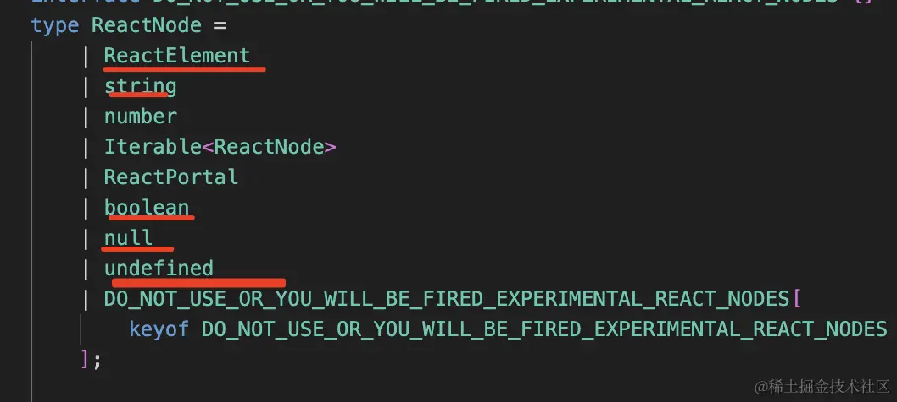
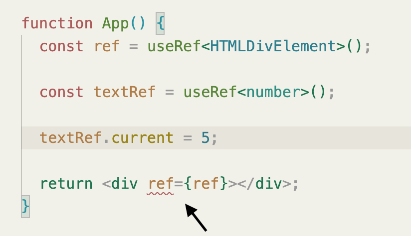
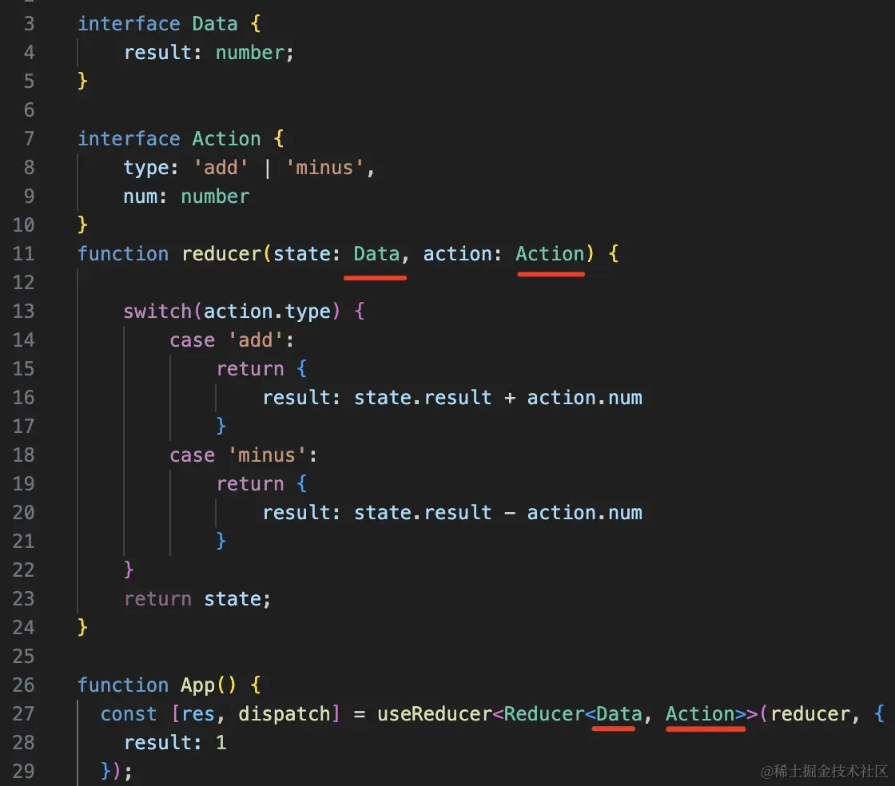
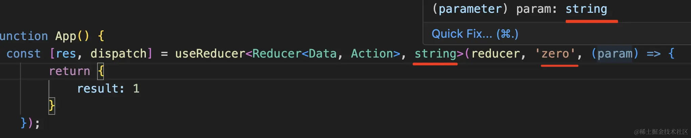

# React 结合 TS

需要安装 `@types/react`，它包含了 React 的类型声明文件；`@types/react-dom` 包含了 React DOM 的类型声明文件。

分别包含什么，举例说明！！！

## JSX 的类型

```tsx
const a = <h1>hello</h1>;
```

声明一个 JSX 元素，它的推导类型是 `JSX.Element`。

而 `JSX.Element` 继承自 `React.ReactElement`，声明这两种类型都能表示 JSX 元素。

但是不能表示 null 或 undefined，所以我们通常使用 `React.ReactNode` 来表示 JSX 元素、null 或 undefined。



## 函数组件的类型

```tsx
import { FC } from "react";

interface IProps {
  name: string;
}

const App: FC<IProps> = ({ name }) => {
  return <h1>{name}</h1>;
};
```

在使用箭头函数时，我们可以使用 `FC` 类型来声明函数组件的类型。并通过范型来传递组件的 props 类型。

也可以通过函数声明来定义组件，但是不能使用 FC 类型。FC 类型规定了函数必须返回一个 JSX 元素，而函数声明的组件可以返回任何类型的值。所以使用箭头函数配合 FC 类型声明函数组件是最佳实践。

```tsx
function App({ name }: IProps): ReactElement {
  return <h1>{name}</h1>;
}
```

当通过函数参数中的 children 访问组件的子元素时，我们可以使用 `ReactNode` 类型来声明。

```tsx
interface IProps {
  name: string;
  children: ReactNode;
}
```

## hook 的类型

### 通常使用范型来传递参数类型。

```tsx
const [count, setCount] = useState<number>(0);

const obj = useMemo<{ name: string }>(() => ({ name: "jack" }), []);

const fn = useCallback<(name: string) => void>((name) => console.log(name), []);
```

当然，能推导的就推导，不需要写范型。

### useRef

当使用 useRef 保存 DOM 引用时，可以使用类似 `HTMLDivElement` 这样的类型来声明。

```tsx
const inputRef = useRef<HTMLInputElement>(null);

const divRef = useRef<HTMLDivElement>(null);
```

当使用 useRef 保存 DOM 引用时，必须使用 null 来初始化，否则会报错。但保存其他引用时，可以不初始化。这是为什么？？



useRef 函数即需要保存 DOM 的引用，又需要保存其他引用。而保存 DOM 引用时，其值因为绑定到了 JSX 元素上，所以需要不可变，而其他引用的值不需要不可变。所以 useRef 存在三个重载函数声明。

```ts
function useRef<T>(initialValue: T): MutableRefObject<T>;
function useRef<T>(initialValue: T | null): RefObject<T>;
function useRef<T = undefined>(): MutableRefObject<T | undefined>;
```

```ts
interface RefObject<T> {
  /**
   * The current value of the ref.
   */
  readonly current: T | null;
}

interface MutableRefObject<T> {
  current: T;
}
```

可见在返回 RefObject 时，current 是只读的，而在返回 MutableRefObject 时，current 是可变的。

- 当没有为 useRef 初始化时，命中第三个类型声明，返回 MutableRefObject。
- 当为 useRef 初始化的值的类型为范型 T 时，命中第一个类型声明，返回 MutableRefObject。
- 当为 useRef 初始化为 null，且范型 T 中不包含 null 时，命中第二个类型声明，返回 RefObject。当需要保存 DOM 引用时，范型 T 的值为 HTMLDivElement 等类型，不包含 null，此时初始化为 null，所以命中第二个类型声明。所以必须使用 null 来初始化，如果不初始化会命中第三个，导致违反引用 DOM 的值不可变的原则，报错。使用其它类型的值如 0 来初始化，则没有函数重载可以命中也会报错。

### useReducer

useReducer 可以传一个类型参数也可以传两个：

当传一个的时候，是 Reducer<xx,yy> 类型，xx 是 state 的类型，yy 是 action 的类型。



当传了第二个的时候，就是传入的初始化函数参数的类型。



## CSS 的类型

当一个变量或函数的参数的值需要是 CSS 样式时，我们可以使用 `CSSProperties` 类型来声明；当值需要是某个 CSS 属性的值时，我们可以使用 `CSSProperties["color"]` 这样的类型来声明。编辑器会提供代码补全提示。

```tsx
const style: CSSProperties = { color: "red" };

const color: CSSProperties["color"] = "red";
```

## HTMLAttributes

当你需要为一个组件传入很多 HTML 标签的属性作为参数，可以将参数类型继承 `HTMLAttributes` 类型。

```tsx
interface IHomeProps extends HTMLAttributes<HTMLDivElement> {}

const Home: FC<IHomeProps> = () => {
  return <></>;
};

function App() {
  return <Home />;
}
```

HTMLAttributes 是一个泛型接口，它的参数是一个 HTMLElement 的类型。不管泛型参数传入什么类型，都会返回一个包含了所有 HTML 元素上都可以访问的公共属性的类型。如 id 和 className 等。所以你只是想类型化一个接受所有公共属性的组件的话，使用 `HTMLAttributes<HTMLElement>` 就可以了，除非有语义化的需求，如想类型化一个接收所有 div 元素的属性的组件，就可以声明为`HTMLAttributes<HTMLDivElement>`。

一些标签特有的属性需要特殊的泛型接口：

如 `HTMLAttributes<HTMLAnchorElement>` 也只能拿到公共属性，拿不到 a 标签的 href 属性。需要 `AnchorHTMLAttributes<HTMLAnchorElement>` 配合使用。 `AnchorHTMLAttributes` 即可以拿到公共属性，也可以拿到 a 标签独有的属性。

类似的，表单元素特有的属性和事件可以使用 `FormHTMLAttributes<HTMLFormELement>` `InputHTMLAttributes<HTMLInputElement>`、`ButtonHTMLAttributes<HTMLButtonElement>`。

图片，`ImgHTMLAttributes<HTMLImageElement>`。

## ComponentProps

ComponentProps 是一个泛型接口，它的参数是一个字符串，它会返回一个包含了该字符串对应的 HTML 元素的所有属性的类型。

所以也可以继承 `ComponentProps` 泛型接口，如 `ComponentProps<'a'>` `ComponentProps<'input'>` `ComponentProps<'button'>`。

同时，ComponentProps 还可以获取一个 React 组件的 props 的类型。

`ComponentProps<typeof Home>`。

## try/catch 中的类型

catch 语句捕获的错误对象的类型必须是 any 或者 unknown。因为 try 语句中可以抛出任何类型的错误， 为了让 catch 语句捕获所有可能的错误类型，就必须是 any 或者 unknown。

```tsx
try {
  throw new Error("error");
} catch (e: any) {
  console.log(e);
}
```

## 事件处理函数的类型

组件可以将函数作为参数传递给子组件，如果这个函数需要是一个事件处理函数，那么它的参数类型可以声明为 `xxxEventHandler`。如 MouseEventHandler、ChangeEventHandler 等

```tsx
interface IHomeProps {
  clickHandler: MouseEventHandler;
}
```

或者自己声明，事件处理对象可以声明为 MouseEvent、ChangeEvent 等。

```tsx
interface IHomeProps {
  clickHandler: (e: MouseEvent) => void;
}
```
